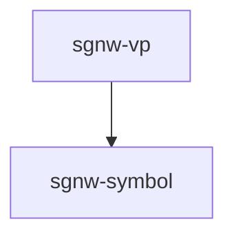
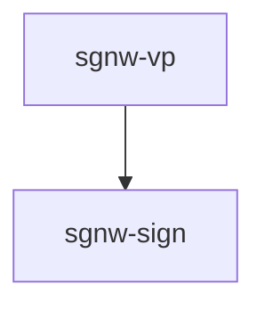
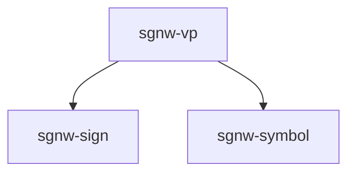
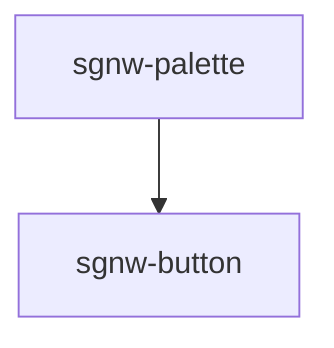
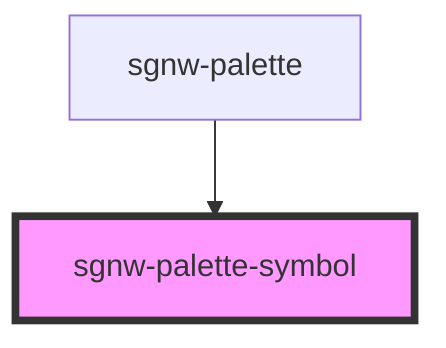
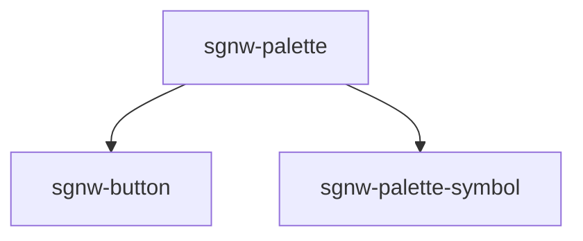

[Read Me](README.md) | 
[Using the Components](USAGE.md) | 
[&lt;sgnw-components />](SGNW-COMPONENTS.md) | 
[&lt;fsw-components />](FSW-COMPONENTS.md) | 
[Change Log](CHANGELOG.md)

---

# Sutton SignWriting Web Components

**&lt;sgnw-components /&gt;** use [SignWriting in Unicode (SWU)](https://tools.ietf.org/id/draft-slevinski-formal-signwriting-09.html#name-signwriting-in-unicode-swu) characters.

- [sgnw-symbol](SGNW-COMPONENTS.md#sgnw-symbol)
- [sgnw-sign](SGNW-COMPONENTS.md#sgnw-sign)
- [sgnw-vp](SGNW-COMPONENTS.md#sgnw-vp)
- [sgnw-button](SGNW-COMPONENTS.md#sgnw-button)
- [sgnw-palette-symbol](SGNW-COMPONENTS.md#sgnw-palette-symbol)
- [sgnw-palette](SGNW-COMPONENTS.md#sgnw-palette)
- [sgnw-signbox](SGNW-COMPONENTS.md#sgnw-signbox)

---

## sgnw-symbol

The sgnw-symbol component can be used to create a symbol image

### sgnw-symbol
<sgnw-symbol symbol="񄵡"></sgnw-symbol>

    <sgnw-symbol symbol="񄵡"></sgnw-symbol>

### sgnw-symbol with style string
<sgnw-symbol symbol="񄵡" styling="-CZ2"></sgnw-symbol>

    <sgnw-symbol symbol="񄵡" styling="-CZ2"></sgnw-symbol>

<!-- Auto Generated Below -->

### Properties

| Property  | Attribute | Description              | Type     | Default     |
| --------- | --------- | ------------------------ | -------- | ----------- |
| `styling` | `styling` | Style String for symbol  | `string` | `undefined` |
| `symbol`  | `symbol`  | SWU character for symbol | `string` | `undefined` |

### Dependencies

#### Used by

 - [sgnw-vp](#sgnw-vp)

#### Graph

----------------------------------------------

## sgnw-sign

The sgnw-sign component can be used to create a sign image

### sgnw-sign
<sgnw-sign sign="𝠀񁳴񁳶񉌍񉌕񁳲񁳸𝠃𝤭𝤩񁳼𝣭𝣤񁳴𝤉𝣤񉌍𝤡𝣺񉌕𝣠𝣺񁳺𝣭𝤑񁳲𝤉𝤑"></sgnw-sign>

    <sgnw-sign sign="𝠀񁳴񁳶񉌍񉌕񁳲񁳸𝠃𝤭𝤩񁳼𝣭𝣤񁳴𝤉𝣤񉌍𝤡𝣺񉌕𝣠𝣺񁳺𝣭𝤑񁳲𝤉𝤑"></sgnw-sign>

### sgnw-sign with style string
<sgnw-sign sign="𝠀񁳴񁳶񉌍񉌕񁳲񁳸𝠃𝤭𝤩񁳼𝣭𝣤񁳴𝤉𝣤񉌍𝤡𝣺񉌕𝣠𝣺񁳺𝣭𝤑񁳲𝤉𝤑" styling="-CZ2"></sgnw-sign>

    <sgnw-sign sign="𝠀񁳴񁳶񉌍񉌕񁳲񁳸𝠃𝤭𝤩񁳼𝣭𝣤񁳴𝤉𝣤񉌍𝤡𝣺񉌕𝣠𝣺񁳺𝣭𝤑񁳲𝤉𝤑" styling="-CZ2"></sgnw-sign>

<!-- Auto Generated Below -->

### Properties

| Property  | Attribute | Description           | Type     | Default     |
| --------- | --------- | --------------------- | -------- | ----------- |
| `sign`    | `sign`    | SWU string for sign   | `string` | `undefined` |
| `styling` | `styling` | Style String for sign | `string` | `undefined` |

### Dependencies

#### Used by

 - [sgnw-vp](#sgnw-vp)

#### Graph

----------------------------------------------

## sgnw-vp

The sgnw-vp component can be used to create a sign text paragraph

### sgnw-vp
<sgnw-vp vp="𝠀񀀒񀀚񋚥񋛩𝠃𝤟𝤩񋛩𝣵𝤐񀀒𝤇𝣤񋚥𝤐𝤆񀀚𝣮𝣭 𝠀񂇢񂇈񆙡񋎥񋎵𝠃𝤛𝤬񂇈𝤀𝣺񂇢𝤄𝣻񋎥𝤄𝤗񋎵𝤃𝣟񆙡𝣱𝣸 𝠀񅨑񀀙񆉁𝠃𝤙𝤞񀀙𝣷𝤀񅨑𝣼𝤀񆉁𝣳𝣮 񏌁𝣢𝤂 𝠀񀕁𝠃𝤍𝤕񀕁𝣾𝣷 𝠀񂌢񂇷񆙡񈗦𝠃𝤩𝤛񂌢𝣢𝣱񂇷𝣬𝤉񆙡𝤍𝣽񈗦𝤜𝤎 񏊡𝣡𝤂 𝠀񀀡𝠃𝤎𝤕񀀡𝣿𝣷 𝠀񀀒񉁩񌏁𝠃𝤮𝤙񌏁𝣴𝣴񀀒𝤙𝣻񉁩𝤙𝣟 𝠀񀕁񀕉񆇡񈩡񈩽񆇡񋺁񌀇񌀃𝠃𝤲𝤡񀕉𝣨𝤃񀕁𝤖𝤃񌀇𝣴𝣴񆇡𝤙𝣶񆇡𝣩𝣶񈩡𝤊𝣢񈩽𝣕𝣡񌀃𝣴𝣴񋺁𝣽𝣗 񏊡𝣡𝤂 𝠀񀕡𝠃𝤎𝤕񀕡𝣿𝣷 𝠀񀀒񉁩񌏁𝠃𝤮𝤙񌏁𝣴𝣴񀀒𝤙𝣻񉁩𝤙𝣟 𝠀񀂁񂇻񈟃񆕁𝠃𝤣𝤘񂇻𝤈𝤌񆕁𝣹𝤁񀂁𝤍𝣵񈟃𝣩𝣽 𝠀񀀡񋎥񀀁𝠃𝤡𝤖񀀁𝤒𝣸񀀡𝣫𝣸񋎥𝣻𝣷 𝠀񀀓񃛆񆿅񆕁𝠃𝤣𝤟񀀓𝤅𝣯񆕁𝤅𝣽񃛆𝣪𝣮񆿅𝤅𝤐 񏌁𝣢𝤂 𝠀񂇢񉳍񂇂񂇈𝠃𝤬𝤘񂇢𝤕𝣵񂇈𝣡𝣴񂇂𝣤𝣵񉳍𝣿𝣼 𝠀񀀒񀀚񋠥񋡩𝠃𝤝𝤪񋡩𝣷𝤊񀀒𝤈𝣡񋠥𝤍𝤃񀀚𝣯𝣪 𝠀񃧁񃧉񆿅񆿕񋸥𝠃𝤨𝤛񆿕𝣭𝤉񃧁𝤌𝣱񃧉𝣥𝣱񆿅𝤔𝤊񋸥𝣿𝤕 񏌁𝣢𝤂 𝠀񅡁񂇸񈗨񈗨񂇑񂇙񇀥񇀵𝠃𝤤𝤸񂇸𝣨𝣚񂇑𝤕𝤝񂇙𝣳𝤝񅡁𝣼𝣦񇀵𝣱𝣺񈗨𝤊𝣔񇀥𝤔𝣻񈗨𝤖𝣞 𝠀񄹸񈗦񄾘𝠃𝤭𝤥񄹸𝣞𝣦񄾘𝤔𝤌񈗦𝣽𝣾 𝠃𝤗𝤜񀀋𝣹𝤍񀁂𝣵𝣱 񏊡𝣡𝤂 𝠀񆅁񇅅𝠃𝤏𝤙񆅁𝣿𝣳񇅅𝣾𝤇 񏌁𝣢𝤂 𝠃𝤦𝤖񄵡𝣧𝣷񆅁𝤁𝤆񃉡𝤔𝣸 񏊡𝣡𝤂 𝠃𝤧𝤬񅩱𝤊𝤝񍳡𝣴𝣴 𝠃𝤼𝤘񃛋𝣳𝣶񃛃𝤇𝣶񈙇𝤞𝣵񈙓𝣐𝣵񆇡𝤂𝤍 񏊡𝣡𝤂 𝠀񂋣񂋫񆕁񇆡𝠃𝤜𝤞񇆡𝣹𝣯񂋣𝤁𝤆񂋫𝣱𝤋񆕁𝣿𝣿 𝠀񀟡񆄩񆕁񈟃񍩁𝠃𝤟𝥄񆄩𝤉𝤵񀟡𝤐𝤕񆕁𝤁𝤥񈟃𝣰𝤟񍩁𝣴𝣴 񏊡𝣡𝤂 𝠃𝤹𝤰񅊰𝣒𝣣񅊂𝣴𝣝񈙆𝤈𝣺񈙖𝣥𝣼񅑢𝤠𝤏񅒐𝣺𝤐 𝠀񃁁񃁉񋠩񋡭񋸡𝠃𝤦𝤬񃁁𝤇𝤝񃁉𝣥𝤑񋡭𝣯𝣨񋠩𝤌𝣵񋸡𝤀𝣠 񏌁𝣢𝤂 𝠃𝤦𝤖񄵡𝣧𝣷񆅁𝤁𝤆񃉡𝤔𝣸 𝠀񃧁񃧉񆿅񆿕񋸥𝠃𝤨𝤛񆿕𝣭𝤉񃧁𝤌𝣱񃧉𝣥𝣱񆿅𝤔𝤊񋸥𝣿𝤕 񏊡𝣡𝤂 𝠀񀀒񀀚񋠥񋡩𝠃𝤝𝤪񋡩𝣷𝤊񀀒𝤈𝣡񋠥𝤍𝤃񀀚𝣯𝣪 𝠀񅡁񂇇񉨬𝠃𝤖𝤥񂇇𝣶𝣦񅡁𝣾𝣵񉨬𝣶𝤂 𝠀񆅱񆅹񇆥񇆵񌁵𝠃𝤢𝥇񆅱𝤎𝤤񆅹𝣯𝤤񇆥𝤉𝤹񇆵𝣩𝤹񌁵𝣴𝣯 񏌁𝣢𝤂"></sgnw-vp>

    <sgnw-vp vp="𝠀񀀒񀀚񋚥񋛩𝠃𝤟𝤩񋛩𝣵𝤐񀀒𝤇𝣤񋚥𝤐𝤆񀀚𝣮𝣭 𝠀񂇢񂇈񆙡񋎥񋎵𝠃𝤛𝤬񂇈𝤀𝣺񂇢𝤄𝣻񋎥𝤄𝤗񋎵𝤃𝣟񆙡𝣱𝣸 𝠀񅨑񀀙񆉁𝠃𝤙𝤞񀀙𝣷𝤀񅨑𝣼𝤀񆉁𝣳𝣮 񏌁𝣢𝤂 𝠀񀕁𝠃𝤍𝤕񀕁𝣾𝣷 𝠀񂌢񂇷񆙡񈗦𝠃𝤩𝤛񂌢𝣢𝣱񂇷𝣬𝤉񆙡𝤍𝣽񈗦𝤜𝤎 񏊡𝣡𝤂 𝠀񀀡𝠃𝤎𝤕񀀡𝣿𝣷 𝠀񀀒񉁩񌏁𝠃𝤮𝤙񌏁𝣴𝣴񀀒𝤙𝣻񉁩𝤙𝣟 𝠀񀕁񀕉񆇡񈩡񈩽񆇡񋺁񌀇񌀃𝠃𝤲𝤡񀕉𝣨𝤃񀕁𝤖𝤃񌀇𝣴𝣴񆇡𝤙𝣶񆇡𝣩𝣶񈩡𝤊𝣢񈩽𝣕𝣡񌀃𝣴𝣴񋺁𝣽𝣗 񏊡𝣡𝤂 𝠀񀕡𝠃𝤎𝤕񀕡𝣿𝣷 𝠀񀀒񉁩񌏁𝠃𝤮𝤙񌏁𝣴𝣴񀀒𝤙𝣻񉁩𝤙𝣟 𝠀񀂁񂇻񈟃񆕁𝠃𝤣𝤘񂇻𝤈𝤌񆕁𝣹𝤁񀂁𝤍𝣵񈟃𝣩𝣽 𝠀񀀡񋎥񀀁𝠃𝤡𝤖񀀁𝤒𝣸񀀡𝣫𝣸񋎥𝣻𝣷 𝠀񀀓񃛆񆿅񆕁𝠃𝤣𝤟񀀓𝤅𝣯񆕁𝤅𝣽񃛆𝣪𝣮񆿅𝤅𝤐 񏌁𝣢𝤂 𝠀񂇢񉳍񂇂񂇈𝠃𝤬𝤘񂇢𝤕𝣵񂇈𝣡𝣴񂇂𝣤𝣵񉳍𝣿𝣼 𝠀񀀒񀀚񋠥񋡩𝠃𝤝𝤪񋡩𝣷𝤊񀀒𝤈𝣡񋠥𝤍𝤃񀀚𝣯𝣪 𝠀񃧁񃧉񆿅񆿕񋸥𝠃𝤨𝤛񆿕𝣭𝤉񃧁𝤌𝣱񃧉𝣥𝣱񆿅𝤔𝤊񋸥𝣿𝤕 񏌁𝣢𝤂 𝠀񅡁񂇸񈗨񈗨񂇑񂇙񇀥񇀵𝠃𝤤𝤸񂇸𝣨𝣚񂇑𝤕𝤝񂇙𝣳𝤝񅡁𝣼𝣦񇀵𝣱𝣺񈗨𝤊𝣔񇀥𝤔𝣻񈗨𝤖𝣞 𝠀񄹸񈗦񄾘𝠃𝤭𝤥񄹸𝣞𝣦񄾘𝤔𝤌񈗦𝣽𝣾 𝠃𝤗𝤜񀀋𝣹𝤍񀁂𝣵𝣱 񏊡𝣡𝤂 𝠀񆅁񇅅𝠃𝤏𝤙񆅁𝣿𝣳񇅅𝣾𝤇 񏌁𝣢𝤂 𝠃𝤦𝤖񄵡𝣧𝣷񆅁𝤁𝤆񃉡𝤔𝣸 񏊡𝣡𝤂 𝠃𝤧𝤬񅩱𝤊𝤝񍳡𝣴𝣴 𝠃𝤼𝤘񃛋𝣳𝣶񃛃𝤇𝣶񈙇𝤞𝣵񈙓𝣐𝣵񆇡𝤂𝤍 񏊡𝣡𝤂 𝠀񂋣񂋫񆕁񇆡𝠃𝤜𝤞񇆡𝣹𝣯񂋣𝤁𝤆񂋫𝣱𝤋񆕁𝣿𝣿 𝠀񀟡񆄩񆕁񈟃񍩁𝠃𝤟𝥄񆄩𝤉𝤵񀟡𝤐𝤕񆕁𝤁𝤥񈟃𝣰𝤟񍩁𝣴𝣴 񏊡𝣡𝤂 𝠃𝤹𝤰񅊰𝣒𝣣񅊂𝣴𝣝񈙆𝤈𝣺񈙖𝣥𝣼񅑢𝤠𝤏񅒐𝣺𝤐 𝠀񃁁񃁉񋠩񋡭񋸡𝠃𝤦𝤬񃁁𝤇𝤝񃁉𝣥𝤑񋡭𝣯𝣨񋠩𝤌𝣵񋸡𝤀𝣠 񏌁𝣢𝤂 𝠃𝤦𝤖񄵡𝣧𝣷񆅁𝤁𝤆񃉡𝤔𝣸 𝠀񃧁񃧉񆿅񆿕񋸥𝠃𝤨𝤛񆿕𝣭𝤉񃧁𝤌𝣱񃧉𝣥𝣱񆿅𝤔𝤊񋸥𝣿𝤕 񏊡𝣡𝤂 𝠀񀀒񀀚񋠥񋡩𝠃𝤝𝤪񋡩𝣷𝤊񀀒𝤈𝣡񋠥𝤍𝤃񀀚𝣯𝣪 𝠀񅡁񂇇񉨬𝠃𝤖𝤥񂇇𝣶𝣦񅡁𝣾𝣵񉨬𝣶𝤂 𝠀񆅱񆅹񇆥񇆵񌁵𝠃𝤢𝥇񆅱𝤎𝤤񆅹𝣯𝤤񇆥𝤉𝤹񇆵𝣩𝤹񌁵𝣴𝣯 񏌁𝣢𝤂"></sgnw-vp>

<!-- Auto Generated Below -->

### Properties

| Property   | Attribute  | Description   | Type      | Default     |
| ---------- | ---------- | ------------- | --------- | ----------- |
| `colorize` | `colorize` | Colorize flag | `boolean` | `undefined` |
| `vp`       | `vp`       | SWU text      | `string`  | `undefined` |

### Dependencies

#### Depends on

- [sgnw-sign](#sgnw-sign)
- [sgnw-symbol](#sgnw-symbol)

#### Graph

----------------------------------------------

## sgnw-button

The sgnw-button component can be used to create buttons with symbols, signs, and svg.

### Basic Example

<sgnw-button symbol="񄵡"></sgnw-button>

    <sgnw-button symbol="񄵡"></sgnw-button>

<!-- Auto Generated Below -->

### Properties

| Property | Attribute | Description              | Type     | Default     |
| -------- | --------- | ------------------------ | -------- | ----------- |
| `sign`   | `sign`    | SWU string for sign      | `string` | `undefined` |
| `svg`    | `svg`     | SVG icon                 | `string` | `undefined` |
| `symbol` | `symbol`  | SWU character for symbol | `string` | `undefined` |

### Dependencies

#### Used by

 - [sgnw-palette](#sgnw-palette)

#### Graph

----------------------------------------------

## sgnw-palette-symbol

The sgnw-palette-symbol component is used inside the sgnw-palette.

### Basic Example

<sgnw-palette-symbol style="height:5rem;width:5rem;display:inline-block" symbol="񄵡"></sgnw-palette-symbol>

    <sgnw-palette-symbol symbol="񄵡"></sgnw-palette-symbol>

<!-- Auto Generated Below -->

### Properties

| Property | Attribute | Description              | Type     | Default     |
| -------- | --------- | ------------------------ | -------- | ----------- |
| `symbol` | `symbol`  | SWU character for symbol | `string` | `undefined` |

### Events

| Event                | Description                             | Type                                                                       |
| -------------------- | --------------------------------------- | -------------------------------------------------------------------------- |
| `paletteSymbolClick` | click event for the symbol palette      | `CustomEvent<string>`                                                      |
| `paletteSymbolDrop`  | drop event for the signbox and sequence | `CustomEvent<{ encoding: string; symbol: string; x: number; y: number; }>` |

### Dependencies

#### Used by

 - [sgnw-palette](#sgnw-palette)

#### Graph

----------------------------------------------

## sgnw-palette

The sgnw-palette components allows for access to the symbols of the ISWA 2010.

### Basic Example

<sgnw-palette orientation="horizontal" size="small"></sgnw-palette>

    <sgnw-palette orientation="horizontal" size="small"></sgnw-palette>

<!-- Auto Generated Below -->

### Properties

| Property      | Attribute     | Description                       | Type                             | Default       |
| ------------- | ------------- | --------------------------------- | -------------------------------- | ------------- |
| `alphabet`    | `alphabet`    | set of symbols                    | `object \| string`               | `iswa2010SWU` |
| `base`        | `base`        | mid level symbol selection        | `string`                         | `null`        |
| `group`       | `group`       | top level symbol selection        | `string`                         | `null`        |
| `lower`       | `lower`       | flag for small and medium palette | `boolean`                        | `false`       |
| `more`        | `more`        | flag for small palette            | `boolean`                        | `false`       |
| `orientation` | `orientation` | orientation of palette            | `"horizontal" \| "vertical"`     | `"vertical"`  |
| `size`        | `size`        | size of palette                   | `"large" \| "medium" \| "small"` | `"small"`     |

### Dependencies

#### Depends on

- [sgnw-button](#sgnw-button)
- [sgnw-palette-symbol](#sgnw-palette-symbol)

#### Graph

----------------------------------------------

## sgnw-signbox

The sgnw-signbox component is currently a placeholder for future development. It currently listens for the paletteSymbolDrop event and console logs the results.

### Basic Example

<sgnw-signbox></sgnw-signbox>

    <sgnw-signbox></sgnw-signbox>

<!-- Auto Generated Below -->

----------------------------------------------

