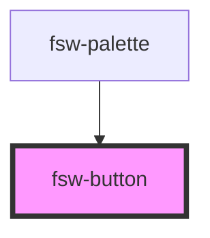

# fsw-button

The fsw-button component can be used to create buttons with symbols, signs, and svg.

## Basic Example

<fsw-button symbol="S10000"></fsw-button>

    <fsw-button symbol="S10000"></fsw-button>

<!-- Auto Generated Below -->

## Properties

| Property | Attribute | Description         | Type     | Default     |
| -------- | --------- | ------------------- | -------- | ----------- |
| `sign`   | `sign`    | FSW string for sign | `string` | `undefined` |
| `svg`    | `svg`     | SVG icon            | `string` | `undefined` |
| `symbol` | `symbol`  | FSW key for symbol  | `string` | `undefined` |

## Dependencies

### Used by

 - [fsw-palette](../fsw-palette)

### Graph

----------------------------------------------

