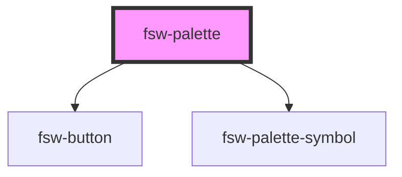

# fsw-palette

The fsw-palette components allows for access to the symbols of the ISWA 2010.

## Basic Example

<fsw-palette orientation="horizontal" size="small"></fsw-palette>

    <fsw-palette orientation="horizontal" size="small"></fsw-palette>

<!-- Auto Generated Below -->

## Properties

| Property      | Attribute     | Description                       | Type                             | Default       |
| ------------- | ------------- | --------------------------------- | -------------------------------- | ------------- |
| `alphabet`    | `alphabet`    | set of symbols                    | `object \| string`               | `iswa2010FSW` |
| `base`        | `base`        | mid level symbol selection        | `string`                         | `null`        |
| `group`       | `group`       | top level symbol selection        | `string`                         | `null`        |
| `lower`       | `lower`       | flag for small and medium palette | `boolean`                        | `false`       |
| `more`        | `more`        | flag for small palette            | `boolean`                        | `false`       |
| `orientation` | `orientation` | orientation of palette            | `"horizontal" \| "vertical"`     | `"vertical"`  |
| `size`        | `size`        | size of palette                   | `"large" \| "medium" \| "small"` | `"small"`     |

## Dependencies

### Depends on

- [fsw-button](../fsw-button)
- [fsw-palette-symbol](../fsw-palette-symbol)

### Graph

----------------------------------------------

