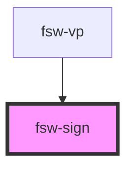

# fsw-sign

The fsw-sign component can be used to create a sign image

## fsw-sign
<fsw-sign sign="AS10011S10019S2e704S2e748M525x535S2e748483x510S10011501x466S2e704510x500S10019476x475"></fsw-sign>

    <fsw-sign sign="AS10011S10019S2e704S2e748M525x535S2e748483x510S10011501x466S2e704510x500S10019476x475"></fsw-sign>

## fsw-sign with style string
<fsw-sign sign="AS10011S10019S2e704S2e748M525x535S2e748483x510S10011501x466S2e704510x500S10019476x475" styling="-CZ2"></fsw-sign>

    <fsw-sign sign="AS10011S10019S2e704S2e748M525x535S2e748483x510S10011501x466S2e704510x500S10019476x475" styling="-CZ2"></fsw-sign>

<!-- Auto Generated Below -->

## Properties

| Property  | Attribute | Description           | Type     | Default     |
| --------- | --------- | --------------------- | -------- | ----------- |
| `sign`    | `sign`    | FSW string for sign   | `string` | `undefined` |
| `styling` | `styling` | Style String for sign | `string` | `undefined` |

## Dependencies

### Used by

 - [fsw-vp](../fsw-vp)

### Graph

----------------------------------------------

