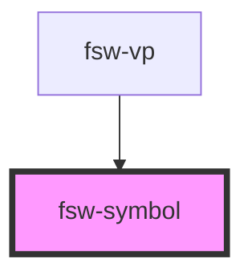

# fsw-symbol

The fsw-symbol component can be used to create a symbol image

## fsw-symbol
<fsw-symbol symbol="S10000"></fsw-symbol>

    <fsw-symbol symbol="S10000"></fsw-symbol>

## fsw-symbol with style string
<fsw-symbol symbol="S10020" styling="-CZ2"></fsw-symbol>

    <fsw-symbol symbol="S10020" styling="-CZ2"></fsw-symbol>

<!-- Auto Generated Below -->

## Properties

| Property  | Attribute | Description             | Type     | Default     |
| --------- | --------- | ----------------------- | -------- | ----------- |
| `styling` | `styling` | Style String for symbol | `string` | `undefined` |
| `symbol`  | `symbol`  | FSW key for symbol      | `string` | `undefined` |

## Dependencies

### Used by

 - [fsw-vp](../fsw-vp)

### Graph

----------------------------------------------

