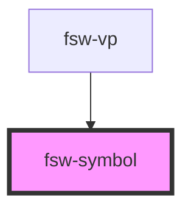

# fsw-symbol

This is a basic symbol <fsw-symbol>S10000</fsw-symbol>

    
This is a basic symbol <fsw-symbol>S10000</fsw-symbol>

You can also use the "symbol" attribute <fsw-symbol symbol="S10000" />

    
You can also use the "symbol" attribute <fsw-symbol symbol="S10000" />

<h1 class="red">Header 1 with class <fsw-symbol symbol="S10000" /></h1>

    <h1 class="red">Header 1 with class <fsw-symbol symbol="S10000" /></h1>

<h2 style="color:blue;background-color:yellow;padding:10px">Header 2 with inline style <fsw-symbol symbol="S10000" /></h2>

    <h2 style="color:blue;background-color:yellow;padding:10px">Header 2 with inline style <fsw-symbol <fsw-symbol symbol="S10000" /> /></h2>

<h3 class="red">Header 3 with styling override <fsw-symbol symbol="S10000" styling="-CZ2" /></h3>

    <h3 class="red">Header 3 with styling override <fsw-symbol symbol="S10000" styling="-CZ2" /></h3>

<!-- Auto Generated Below -->

## Properties

| Property  | Attribute | Description              | Type     | Default     |
| --------- | --------- | ------------------------ | -------- | ----------- |
| `styling` | `styling` | Style String for symbol  | `string` | `undefined` |
| `symbol`  | `symbol`  | FSW character for symbol | `string` | `undefined` |

## Dependencies

### Used by

 - [fsw-vp](../fsw-vp)

### Graph

----------------------------------------------

