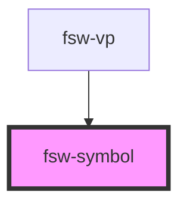

# fsw-symbol

the fsw-symbol element can be used to create an symbol image

## fsw-symbol with text inside
<fsw-symbol>S10000</fsw-symbol>

    <fsw-symbol>S10000</fsw-symbol>

## fsw-symbol with symbol attribute
<fsw-symbol symbol="S10020"></fsw-symbol>

    <fsw-symbol symbol="S10020"></fsw-symbol>

<!-- Auto Generated Below -->

## Properties

| Property  | Attribute | Description              | Type     | Default     |
| --------- | --------- | ------------------------ | -------- | ----------- |
| `styling` | `styling` | Style String for symbol  | `string` | `undefined` |
| `symbol`  | `symbol`  | FSW character for symbol | `string` | `undefined` |

## Dependencies

### Used by

 - [fsw-vp](../fsw-vp)

### Graph

----------------------------------------------

