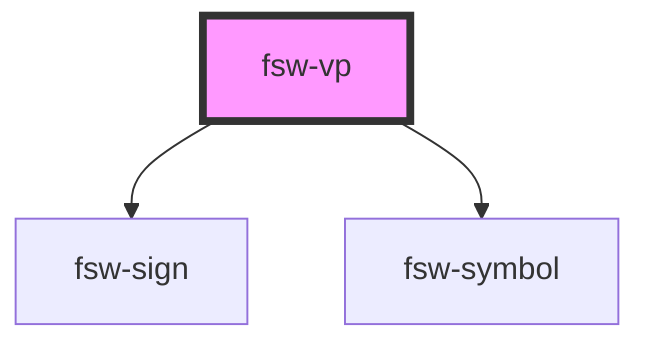

# fsw-vp

This is a basic vertical paragraph

<fsw-vp>AS10011S10019S2e704S2e748L525x535S2e748483x510S10011501x466S2e704510x500S10019476x475 AS15a21S15a07S21100S2df04S2df14R521x538S15a07494x488S15a21498x489S2df04498x517S2df14497x461S21100479x486 AS1f010S10018S20600M519x524S10018485x494S1f010490x494S20600481x476 S38800464x496  and other text here.</fsw-vp>

    
This is a basic vertical paragraph

    <fsw-vp>AS10011S10019S2e704S2e748L525x535S2e748483x510S10011501x466S2e704510x500S10019476x475 AS15a21S15a07S21100S2df04S2df14R521x538S15a07494x488S15a21498x489S2df04498x517S2df14497x461S21100479x486 AS1f010S10018S20600M519x524S10018485x494S1f010490x494S20600481x476 S38800464x496  and other text here.</fsw-vp>

<!-- Auto Generated Below -->

## Properties

| Property | Attribute | Description | Type     | Default     |
| -------- | --------- | ----------- | -------- | ----------- |
| `text`   | `text`    | FSW text    | `string` | `undefined` |

## Dependencies

### Depends on

- [fsw-sign](../fsw-sign)
- [fsw-symbol](../fsw-symbol)

### Graph

----------------------------------------------

