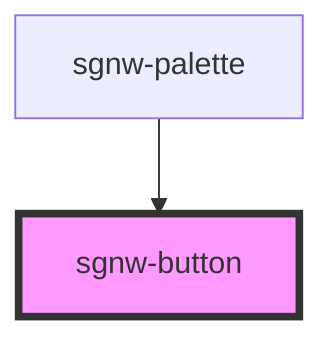

# sgnw-button

The sgnw-button component can be used to create buttons with symbols, signs, and svg.

## Basic Example

<sgnw-button symbol="񄵡"></sgnw-button>

    <sgnw-button symbol="񄵡"></sgnw-button>

<!-- Auto Generated Below -->

## Properties

| Property | Attribute | Description              | Type     | Default     |
| -------- | --------- | ------------------------ | -------- | ----------- |
| `sign`   | `sign`    | SWU string for sign      | `string` | `undefined` |
| `svg`    | `svg`     | SVG icon                 | `string` | `undefined` |
| `symbol` | `symbol`  | SWU character for symbol | `string` | `undefined` |

## Dependencies

### Used by

 - [sgnw-palette](../sgnw-palette)

### Graph

----------------------------------------------

