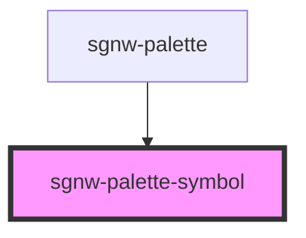

# sgnw-palette-symbol

The sgnw-palette-symbol component is used inside the sgnw-palette.

## Basic Example

<sgnw-palette-symbol style="height:5rem;width:5rem;display:inline-block" symbol="񄵡"></sgnw-palette-symbol>

    <sgnw-palette-symbol symbol="񄵡"></sgnw-palette-symbol>

<!-- Auto Generated Below -->

## Properties

| Property | Attribute | Description              | Type     | Default     |
| -------- | --------- | ------------------------ | -------- | ----------- |
| `symbol` | `symbol`  | SWU character for symbol | `string` | `undefined` |

## Events

| Event                | Description                             | Type                                                                       |
| -------------------- | --------------------------------------- | -------------------------------------------------------------------------- |
| `paletteSymbolClick` | click event for the symbol palette      | `CustomEvent<string>`                                                      |
| `paletteSymbolDrop`  | drop event for the signbox and sequence | `CustomEvent<{ encoding: string; symbol: string; x: number; y: number; }>` |

## Dependencies

### Used by

 - [sgnw-palette](../sgnw-palette)

### Graph

----------------------------------------------

