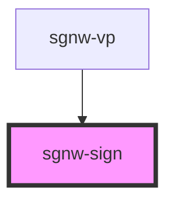

# sgnw-sign

The sgnw-sign component can be used to create a sign image

## sgnw-sign
<sgnw-sign sign="𝠀񁳴񁳶񉌍񉌕񁳲񁳸𝠃𝤭𝤩񁳼𝣭𝣤񁳴𝤉𝣤񉌍𝤡𝣺񉌕𝣠𝣺񁳺𝣭𝤑񁳲𝤉𝤑"></sgnw-sign>

    <sgnw-sign sign="𝠀񁳴񁳶񉌍񉌕񁳲񁳸𝠃𝤭𝤩񁳼𝣭𝣤񁳴𝤉𝣤񉌍𝤡𝣺񉌕𝣠𝣺񁳺𝣭𝤑񁳲𝤉𝤑"></sgnw-sign>

## sgnw-sign with style string
<sgnw-sign sign="𝠀񁳴񁳶񉌍񉌕񁳲񁳸𝠃𝤭𝤩񁳼𝣭𝣤񁳴𝤉𝣤񉌍𝤡𝣺񉌕𝣠𝣺񁳺𝣭𝤑񁳲𝤉𝤑" styling="-CZ2"></sgnw-sign>

    <sgnw-sign sign="𝠀񁳴񁳶񉌍񉌕񁳲񁳸𝠃𝤭𝤩񁳼𝣭𝣤񁳴𝤉𝣤񉌍𝤡𝣺񉌕𝣠𝣺񁳺𝣭𝤑񁳲𝤉𝤑" styling="-CZ2"></sgnw-sign>

<!-- Auto Generated Below -->

## Properties

| Property  | Attribute | Description           | Type     | Default     |
| --------- | --------- | --------------------- | -------- | ----------- |
| `sign`    | `sign`    | SWU string for sign   | `string` | `undefined` |
| `styling` | `styling` | Style String for sign | `string` | `undefined` |

## Dependencies

### Used by

 - [sgnw-vp](../sgnw-vp)

### Graph

----------------------------------------------

