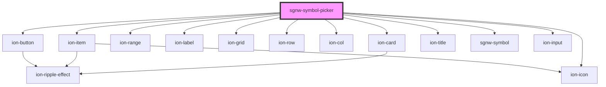

# sgnw-symbol-picker

<!-- Auto Generated Below -->

## Properties

| Property | Attribute | Description                                  | Type     | Default     |
| -------- | --------- | -------------------------------------------- | -------- | ----------- |
| `fsw`    | `fsw`     | Formal SignWriting in ASCII (FSW) for symbol | `string` | `undefined` |
| `iid`    | `iid`     | ISWA 2010 ID for symbol                      | `number` | `undefined` |
| `swu`    | `swu`     | SignWriting in Unicode (SWU) for symbol      | `string` | `undefined` |
| `uni`    | `uni`     | SignWriting in Unicode 8 (uni8) for symbol   | `string` | `undefined` |

## Dependencies

### Depends on

- ion-card
- ion-item
- ion-range
- ion-label
- ion-grid
- ion-row
- ion-col
- ion-button
- ion-icon
- ion-title
- [sgnw-symbol](../sgnw-symbol)
- ion-input

### Graph

----------------------------------------------

