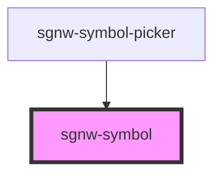

# sgnw-symbol

<!-- Auto Generated Below -->

## Properties

| Property  | Attribute | Description                                                             | Type     | Default     |
| --------- | --------- | ----------------------------------------------------------------------- | -------- | ----------- |
| `fsw`     | `fsw`     | Formal SignWriting in ASCII (FSW) for symbol with optional style string | `string` | `undefined` |
| `iid`     | `iid`     | ISWA 2010 ID                                                            | `number` | `undefined` |
| `styling` | `styling` | Style String for symbol                                                 | `string` | `undefined` |
| `swu`     | `swu`     | SignWriting in Unicode (SWU) for symbol with optional style string      | `string` | `undefined` |

## Dependencies

### Used by

 - [sgnw-symbol-picker](../sgnw-symbol-picker)

### Graph

----------------------------------------------

