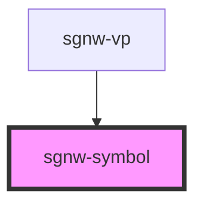

# sgnw-symbol

The sgnw-symbol component can be used to create a symbol image

## sgnw-symbol
<sgnw-symbol symbol="񄵡"></sgnw-symbol>

    <sgnw-symbol symbol="񄵡"></sgnw-symbol>

## sgnw-symbol with style string
<sgnw-symbol symbol="񄵡" styling="-CZ2"></sgnw-symbol>

    <sgnw-symbol symbol="񄵡" styling="-CZ2"></sgnw-symbol>

<!-- Auto Generated Below -->

## Properties

| Property  | Attribute | Description              | Type     | Default     |
| --------- | --------- | ------------------------ | -------- | ----------- |
| `styling` | `styling` | Style String for symbol  | `string` | `undefined` |
| `symbol`  | `symbol`  | SWU character for symbol | `string` | `undefined` |

## Dependencies

### Used by

 - [sgnw-vp](../sgnw-vp)

### Graph

----------------------------------------------

