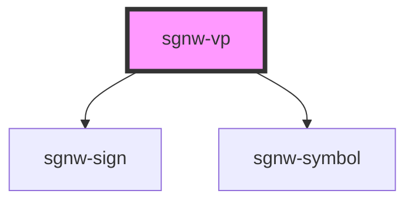

# sgnw-vp

the sgnw-vp element can be used to create a sign text paragraph

## sgnw-vp with text inside
<sgnw-vp>𝠀񀀒񀀚񋚥񋛩𝠃𝤟𝤩񋛩𝣵𝤐񀀒𝤇𝣤񋚥𝤐𝤆񀀚𝣮𝣭 𝠀񂇢񂇈񆙡񋎥񋎵𝠃𝤛𝤬񂇈𝤀𝣺񂇢𝤄𝣻񋎥𝤄𝤗񋎵𝤃𝣟񆙡𝣱𝣸 𝠀񅨑񀀙񆉁𝠃𝤙𝤞񀀙𝣷𝤀񅨑𝣼𝤀񆉁𝣳𝣮 񏌁𝣢𝤂 𝠀񀕁𝠃𝤍𝤕񀕁𝣾𝣷 𝠀񂌢񂇷񆙡񈗦𝠃𝤩𝤛񂌢𝣢𝣱񂇷𝣬𝤉񆙡𝤍𝣽񈗦𝤜𝤎 񏊡𝣡𝤂 𝠀񀀡𝠃𝤎𝤕񀀡𝣿𝣷 𝠀񀀒񉁩񌏁𝠃𝤮𝤙񌏁𝣴𝣴񀀒𝤙𝣻񉁩𝤙𝣟 𝠀񀕁񀕉񆇡񈩡񈩽񆇡񋺁񌀇񌀃𝠃𝤲𝤡񀕉𝣨𝤃񀕁𝤖𝤃񌀇𝣴𝣴񆇡𝤙𝣶񆇡𝣩𝣶񈩡𝤊𝣢񈩽𝣕𝣡񌀃𝣴𝣴񋺁𝣽𝣗 񏊡𝣡𝤂 𝠀񀕡𝠃𝤎𝤕񀕡𝣿𝣷 𝠀񀀒񉁩񌏁𝠃𝤮𝤙񌏁𝣴𝣴񀀒𝤙𝣻񉁩𝤙𝣟 𝠀񀂁񂇻񈟃񆕁𝠃𝤣𝤘񂇻𝤈𝤌񆕁𝣹𝤁񀂁𝤍𝣵񈟃𝣩𝣽 𝠀񀀡񋎥񀀁𝠃𝤡𝤖񀀁𝤒𝣸񀀡𝣫𝣸񋎥𝣻𝣷 𝠀񀀓񃛆񆿅񆕁𝠃𝤣𝤟񀀓𝤅𝣯񆕁𝤅𝣽񃛆𝣪𝣮񆿅𝤅𝤐 񏌁𝣢𝤂 𝠀񂇢񉳍񂇂񂇈𝠃𝤬𝤘񂇢𝤕𝣵񂇈𝣡𝣴񂇂𝣤𝣵񉳍𝣿𝣼 𝠀񀀒񀀚񋠥񋡩𝠃𝤝𝤪񋡩𝣷𝤊񀀒𝤈𝣡񋠥𝤍𝤃񀀚𝣯𝣪 𝠀񃧁񃧉񆿅񆿕񋸥𝠃𝤨𝤛񆿕𝣭𝤉񃧁𝤌𝣱񃧉𝣥𝣱񆿅𝤔𝤊񋸥𝣿𝤕 񏌁𝣢𝤂 𝠀񅡁񂇸񈗨񈗨񂇑񂇙񇀥񇀵𝠃𝤤𝤸񂇸𝣨𝣚񂇑𝤕𝤝񂇙𝣳𝤝񅡁𝣼𝣦񇀵𝣱𝣺񈗨𝤊𝣔񇀥𝤔𝣻񈗨𝤖𝣞 𝠀񄹸񈗦񄾘𝠃𝤭𝤥񄹸𝣞𝣦񄾘𝤔𝤌񈗦𝣽𝣾 𝠃𝤗𝤜񀀋𝣹𝤍񀁂𝣵𝣱 񏊡𝣡𝤂 𝠀񆅁񇅅𝠃𝤏𝤙񆅁𝣿𝣳񇅅𝣾𝤇 񏌁𝣢𝤂 𝠃𝤦𝤖񄵡𝣧𝣷񆅁𝤁𝤆񃉡𝤔𝣸 񏊡𝣡𝤂 𝠃𝤧𝤬񅩱𝤊𝤝񍳡𝣴𝣴 𝠃𝤼𝤘񃛋𝣳𝣶񃛃𝤇𝣶񈙇𝤞𝣵񈙓𝣐𝣵񆇡𝤂𝤍 񏊡𝣡𝤂 𝠀񂋣񂋫񆕁񇆡𝠃𝤜𝤞񇆡𝣹𝣯񂋣𝤁𝤆񂋫𝣱𝤋񆕁𝣿𝣿 𝠀񀟡񆄩񆕁񈟃񍩁𝠃𝤟𝥄񆄩𝤉𝤵񀟡𝤐𝤕񆕁𝤁𝤥񈟃𝣰𝤟񍩁𝣴𝣴 񏊡𝣡𝤂 𝠃𝤹𝤰񅊰𝣒𝣣񅊂𝣴𝣝񈙆𝤈𝣺񈙖𝣥𝣼񅑢𝤠𝤏񅒐𝣺𝤐 𝠀񃁁񃁉񋠩񋡭񋸡𝠃𝤦𝤬񃁁𝤇𝤝񃁉𝣥𝤑񋡭𝣯𝣨񋠩𝤌𝣵񋸡𝤀𝣠 񏌁𝣢𝤂 𝠃𝤦𝤖񄵡𝣧𝣷񆅁𝤁𝤆񃉡𝤔𝣸 𝠀񃧁񃧉񆿅񆿕񋸥𝠃𝤨𝤛񆿕𝣭𝤉񃧁𝤌𝣱񃧉𝣥𝣱񆿅𝤔𝤊񋸥𝣿𝤕 񏊡𝣡𝤂 𝠀񀀒񀀚񋠥񋡩𝠃𝤝𝤪񋡩𝣷𝤊񀀒𝤈𝣡񋠥𝤍𝤃񀀚𝣯𝣪 𝠀񅡁񂇇񉨬𝠃𝤖𝤥񂇇𝣶𝣦񅡁𝣾𝣵񉨬𝣶𝤂 𝠀񆅱񆅹񇆥񇆵񌁵𝠃𝤢𝥇񆅱𝤎𝤤񆅹𝣯𝤤񇆥𝤉𝤹񇆵𝣩𝤹񌁵𝣴𝣯 񏌁𝣢𝤂</sgnw-vp>

    <sgnw-vp>𝠀񀀒񀀚񋚥񋛩𝠃𝤟𝤩񋛩𝣵𝤐񀀒𝤇𝣤񋚥𝤐𝤆񀀚𝣮𝣭 𝠀񂇢񂇈񆙡񋎥񋎵𝠃𝤛𝤬񂇈𝤀𝣺񂇢𝤄𝣻񋎥𝤄𝤗񋎵𝤃𝣟񆙡𝣱𝣸 𝠀񅨑񀀙񆉁𝠃𝤙𝤞񀀙𝣷𝤀񅨑𝣼𝤀񆉁𝣳𝣮 񏌁𝣢𝤂 𝠀񀕁𝠃𝤍𝤕񀕁𝣾𝣷 𝠀񂌢񂇷񆙡񈗦𝠃𝤩𝤛񂌢𝣢𝣱񂇷𝣬𝤉񆙡𝤍𝣽񈗦𝤜𝤎 񏊡𝣡𝤂 𝠀񀀡𝠃𝤎𝤕񀀡𝣿𝣷 𝠀񀀒񉁩񌏁𝠃𝤮𝤙񌏁𝣴𝣴񀀒𝤙𝣻񉁩𝤙𝣟 𝠀񀕁񀕉񆇡񈩡񈩽񆇡񋺁񌀇񌀃𝠃𝤲𝤡񀕉𝣨𝤃񀕁𝤖𝤃񌀇𝣴𝣴񆇡𝤙𝣶񆇡𝣩𝣶񈩡𝤊𝣢񈩽𝣕𝣡񌀃𝣴𝣴񋺁𝣽𝣗 񏊡𝣡𝤂 𝠀񀕡𝠃𝤎𝤕񀕡𝣿𝣷 𝠀񀀒񉁩񌏁𝠃𝤮𝤙񌏁𝣴𝣴񀀒𝤙𝣻񉁩𝤙𝣟 𝠀񀂁񂇻񈟃񆕁𝠃𝤣𝤘񂇻𝤈𝤌񆕁𝣹𝤁񀂁𝤍𝣵񈟃𝣩𝣽 𝠀񀀡񋎥񀀁𝠃𝤡𝤖񀀁𝤒𝣸񀀡𝣫𝣸񋎥𝣻𝣷 𝠀񀀓񃛆񆿅񆕁𝠃𝤣𝤟񀀓𝤅𝣯񆕁𝤅𝣽񃛆𝣪𝣮񆿅𝤅𝤐 񏌁𝣢𝤂 𝠀񂇢񉳍񂇂񂇈𝠃𝤬𝤘񂇢𝤕𝣵񂇈𝣡𝣴񂇂𝣤𝣵񉳍𝣿𝣼 𝠀񀀒񀀚񋠥񋡩𝠃𝤝𝤪񋡩𝣷𝤊񀀒𝤈𝣡񋠥𝤍𝤃񀀚𝣯𝣪 𝠀񃧁񃧉񆿅񆿕񋸥𝠃𝤨𝤛񆿕𝣭𝤉񃧁𝤌𝣱񃧉𝣥𝣱񆿅𝤔𝤊񋸥𝣿𝤕 񏌁𝣢𝤂 𝠀񅡁񂇸񈗨񈗨񂇑񂇙񇀥񇀵𝠃𝤤𝤸񂇸𝣨𝣚񂇑𝤕𝤝񂇙𝣳𝤝񅡁𝣼𝣦񇀵𝣱𝣺񈗨𝤊𝣔񇀥𝤔𝣻񈗨𝤖𝣞 𝠀񄹸񈗦񄾘𝠃𝤭𝤥񄹸𝣞𝣦񄾘𝤔𝤌񈗦𝣽𝣾 𝠃𝤗𝤜񀀋𝣹𝤍񀁂𝣵𝣱 񏊡𝣡𝤂 𝠀񆅁񇅅𝠃𝤏𝤙񆅁𝣿𝣳񇅅𝣾𝤇 񏌁𝣢𝤂 𝠃𝤦𝤖񄵡𝣧𝣷񆅁𝤁𝤆񃉡𝤔𝣸 񏊡𝣡𝤂 𝠃𝤧𝤬񅩱𝤊𝤝񍳡𝣴𝣴 𝠃𝤼𝤘񃛋𝣳𝣶񃛃𝤇𝣶񈙇𝤞𝣵񈙓𝣐𝣵񆇡𝤂𝤍 񏊡𝣡𝤂 𝠀񂋣񂋫񆕁񇆡𝠃𝤜𝤞񇆡𝣹𝣯񂋣𝤁𝤆񂋫𝣱𝤋񆕁𝣿𝣿 𝠀񀟡񆄩񆕁񈟃񍩁𝠃𝤟𝥄񆄩𝤉𝤵񀟡𝤐𝤕񆕁𝤁𝤥񈟃𝣰𝤟񍩁𝣴𝣴 񏊡𝣡𝤂 𝠃𝤹𝤰񅊰𝣒𝣣񅊂𝣴𝣝񈙆𝤈𝣺񈙖𝣥𝣼񅑢𝤠𝤏񅒐𝣺𝤐 𝠀񃁁񃁉񋠩񋡭񋸡𝠃𝤦𝤬񃁁𝤇𝤝񃁉𝣥𝤑񋡭𝣯𝣨񋠩𝤌𝣵񋸡𝤀𝣠 񏌁𝣢𝤂 𝠃𝤦𝤖񄵡𝣧𝣷񆅁𝤁𝤆񃉡𝤔𝣸 𝠀񃧁񃧉񆿅񆿕񋸥𝠃𝤨𝤛񆿕𝣭𝤉񃧁𝤌𝣱񃧉𝣥𝣱񆿅𝤔𝤊񋸥𝣿𝤕 񏊡𝣡𝤂 𝠀񀀒񀀚񋠥񋡩𝠃𝤝𝤪񋡩𝣷𝤊񀀒𝤈𝣡񋠥𝤍𝤃񀀚𝣯𝣪 𝠀񅡁񂇇񉨬𝠃𝤖𝤥񂇇𝣶𝣦񅡁𝣾𝣵񉨬𝣶𝤂 𝠀񆅱񆅹񇆥񇆵񌁵𝠃𝤢𝥇񆅱𝤎𝤤񆅹𝣯𝤤񇆥𝤉𝤹񇆵𝣩𝤹񌁵𝣴𝣯 񏌁𝣢𝤂</sgnw-vp>

## sgnw-vp with vp attribute
<sgnw-vp vp="𝠀񀀒񀀚񋚥񋛩𝠃𝤟𝤩񋛩𝣵𝤐񀀒𝤇𝣤񋚥𝤐𝤆񀀚𝣮𝣭 𝠀񂇢񂇈񆙡񋎥񋎵𝠃𝤛𝤬񂇈𝤀𝣺񂇢𝤄𝣻񋎥𝤄𝤗񋎵𝤃𝣟񆙡𝣱𝣸 𝠀񅨑񀀙񆉁𝠃𝤙𝤞񀀙𝣷𝤀񅨑𝣼𝤀񆉁𝣳𝣮 񏌁𝣢𝤂 𝠀񀕁𝠃𝤍𝤕񀕁𝣾𝣷 𝠀񂌢񂇷񆙡񈗦𝠃𝤩𝤛񂌢𝣢𝣱񂇷𝣬𝤉񆙡𝤍𝣽񈗦𝤜𝤎 񏊡𝣡𝤂 𝠀񀀡𝠃𝤎𝤕񀀡𝣿𝣷 𝠀񀀒񉁩񌏁𝠃𝤮𝤙񌏁𝣴𝣴񀀒𝤙𝣻񉁩𝤙𝣟 𝠀񀕁񀕉񆇡񈩡񈩽񆇡񋺁񌀇񌀃𝠃𝤲𝤡񀕉𝣨𝤃񀕁𝤖𝤃񌀇𝣴𝣴񆇡𝤙𝣶񆇡𝣩𝣶񈩡𝤊𝣢񈩽𝣕𝣡񌀃𝣴𝣴񋺁𝣽𝣗 񏊡𝣡𝤂 𝠀񀕡𝠃𝤎𝤕񀕡𝣿𝣷 𝠀񀀒񉁩񌏁𝠃𝤮𝤙񌏁𝣴𝣴񀀒𝤙𝣻񉁩𝤙𝣟 𝠀񀂁񂇻񈟃񆕁𝠃𝤣𝤘񂇻𝤈𝤌񆕁𝣹𝤁񀂁𝤍𝣵񈟃𝣩𝣽 𝠀񀀡񋎥񀀁𝠃𝤡𝤖񀀁𝤒𝣸񀀡𝣫𝣸񋎥𝣻𝣷 𝠀񀀓񃛆񆿅񆕁𝠃𝤣𝤟񀀓𝤅𝣯񆕁𝤅𝣽񃛆𝣪𝣮񆿅𝤅𝤐 񏌁𝣢𝤂 𝠀񂇢񉳍񂇂񂇈𝠃𝤬𝤘񂇢𝤕𝣵񂇈𝣡𝣴񂇂𝣤𝣵񉳍𝣿𝣼 𝠀񀀒񀀚񋠥񋡩𝠃𝤝𝤪񋡩𝣷𝤊񀀒𝤈𝣡񋠥𝤍𝤃񀀚𝣯𝣪 𝠀񃧁񃧉񆿅񆿕񋸥𝠃𝤨𝤛񆿕𝣭𝤉񃧁𝤌𝣱񃧉𝣥𝣱񆿅𝤔𝤊񋸥𝣿𝤕 񏌁𝣢𝤂 𝠀񅡁񂇸񈗨񈗨񂇑񂇙񇀥񇀵𝠃𝤤𝤸񂇸𝣨𝣚񂇑𝤕𝤝񂇙𝣳𝤝񅡁𝣼𝣦񇀵𝣱𝣺񈗨𝤊𝣔񇀥𝤔𝣻񈗨𝤖𝣞 𝠀񄹸񈗦񄾘𝠃𝤭𝤥񄹸𝣞𝣦񄾘𝤔𝤌񈗦𝣽𝣾 𝠃𝤗𝤜񀀋𝣹𝤍񀁂𝣵𝣱 񏊡𝣡𝤂 𝠀񆅁񇅅𝠃𝤏𝤙񆅁𝣿𝣳񇅅𝣾𝤇 񏌁𝣢𝤂 𝠃𝤦𝤖񄵡𝣧𝣷񆅁𝤁𝤆񃉡𝤔𝣸 񏊡𝣡𝤂 𝠃𝤧𝤬񅩱𝤊𝤝񍳡𝣴𝣴 𝠃𝤼𝤘񃛋𝣳𝣶񃛃𝤇𝣶񈙇𝤞𝣵񈙓𝣐𝣵񆇡𝤂𝤍 񏊡𝣡𝤂 𝠀񂋣񂋫񆕁񇆡𝠃𝤜𝤞񇆡𝣹𝣯񂋣𝤁𝤆񂋫𝣱𝤋񆕁𝣿𝣿 𝠀񀟡񆄩񆕁񈟃񍩁𝠃𝤟𝥄񆄩𝤉𝤵񀟡𝤐𝤕񆕁𝤁𝤥񈟃𝣰𝤟񍩁𝣴𝣴 񏊡𝣡𝤂 𝠃𝤹𝤰񅊰𝣒𝣣񅊂𝣴𝣝񈙆𝤈𝣺񈙖𝣥𝣼񅑢𝤠𝤏񅒐𝣺𝤐 𝠀񃁁񃁉񋠩񋡭񋸡𝠃𝤦𝤬񃁁𝤇𝤝񃁉𝣥𝤑񋡭𝣯𝣨񋠩𝤌𝣵񋸡𝤀𝣠 񏌁𝣢𝤂 𝠃𝤦𝤖񄵡𝣧𝣷񆅁𝤁𝤆񃉡𝤔𝣸 𝠀񃧁񃧉񆿅񆿕񋸥𝠃𝤨𝤛񆿕𝣭𝤉񃧁𝤌𝣱񃧉𝣥𝣱񆿅𝤔𝤊񋸥𝣿𝤕 񏊡𝣡𝤂 𝠀񀀒񀀚񋠥񋡩𝠃𝤝𝤪񋡩𝣷𝤊񀀒𝤈𝣡񋠥𝤍𝤃񀀚𝣯𝣪 𝠀񅡁񂇇񉨬𝠃𝤖𝤥񂇇𝣶𝣦񅡁𝣾𝣵񉨬𝣶𝤂 𝠀񆅱񆅹񇆥񇆵񌁵𝠃𝤢𝥇񆅱𝤎𝤤񆅹𝣯𝤤񇆥𝤉𝤹񇆵𝣩𝤹񌁵𝣴𝣯 񏌁𝣢𝤂"></sgnw-vp>

    <sgnw-vp vp="𝠀񀀒񀀚񋚥񋛩𝠃𝤟𝤩񋛩𝣵𝤐񀀒𝤇𝣤񋚥𝤐𝤆񀀚𝣮𝣭 𝠀񂇢񂇈񆙡񋎥񋎵𝠃𝤛𝤬񂇈𝤀𝣺񂇢𝤄𝣻񋎥𝤄𝤗񋎵𝤃𝣟񆙡𝣱𝣸 𝠀񅨑񀀙񆉁𝠃𝤙𝤞񀀙𝣷𝤀񅨑𝣼𝤀񆉁𝣳𝣮 񏌁𝣢𝤂 𝠀񀕁𝠃𝤍𝤕񀕁𝣾𝣷 𝠀񂌢񂇷񆙡񈗦𝠃𝤩𝤛񂌢𝣢𝣱񂇷𝣬𝤉񆙡𝤍𝣽񈗦𝤜𝤎 񏊡𝣡𝤂 𝠀񀀡𝠃𝤎𝤕񀀡𝣿𝣷 𝠀񀀒񉁩񌏁𝠃𝤮𝤙񌏁𝣴𝣴񀀒𝤙𝣻񉁩𝤙𝣟 𝠀񀕁񀕉񆇡񈩡񈩽񆇡񋺁񌀇񌀃𝠃𝤲𝤡񀕉𝣨𝤃񀕁𝤖𝤃񌀇𝣴𝣴񆇡𝤙𝣶񆇡𝣩𝣶񈩡𝤊𝣢񈩽𝣕𝣡񌀃𝣴𝣴񋺁𝣽𝣗 񏊡𝣡𝤂 𝠀񀕡𝠃𝤎𝤕񀕡𝣿𝣷 𝠀񀀒񉁩񌏁𝠃𝤮𝤙񌏁𝣴𝣴񀀒𝤙𝣻񉁩𝤙𝣟 𝠀񀂁񂇻񈟃񆕁𝠃𝤣𝤘񂇻𝤈𝤌񆕁𝣹𝤁񀂁𝤍𝣵񈟃𝣩𝣽 𝠀񀀡񋎥񀀁𝠃𝤡𝤖񀀁𝤒𝣸񀀡𝣫𝣸񋎥𝣻𝣷 𝠀񀀓񃛆񆿅񆕁𝠃𝤣𝤟񀀓𝤅𝣯񆕁𝤅𝣽񃛆𝣪𝣮񆿅𝤅𝤐 񏌁𝣢𝤂 𝠀񂇢񉳍񂇂񂇈𝠃𝤬𝤘񂇢𝤕𝣵񂇈𝣡𝣴񂇂𝣤𝣵񉳍𝣿𝣼 𝠀񀀒񀀚񋠥񋡩𝠃𝤝𝤪񋡩𝣷𝤊񀀒𝤈𝣡񋠥𝤍𝤃񀀚𝣯𝣪 𝠀񃧁񃧉񆿅񆿕񋸥𝠃𝤨𝤛񆿕𝣭𝤉񃧁𝤌𝣱񃧉𝣥𝣱񆿅𝤔𝤊񋸥𝣿𝤕 񏌁𝣢𝤂 𝠀񅡁񂇸񈗨񈗨񂇑񂇙񇀥񇀵𝠃𝤤𝤸񂇸𝣨𝣚񂇑𝤕𝤝񂇙𝣳𝤝񅡁𝣼𝣦񇀵𝣱𝣺񈗨𝤊𝣔񇀥𝤔𝣻񈗨𝤖𝣞 𝠀񄹸񈗦񄾘𝠃𝤭𝤥񄹸𝣞𝣦񄾘𝤔𝤌񈗦𝣽𝣾 𝠃𝤗𝤜񀀋𝣹𝤍񀁂𝣵𝣱 񏊡𝣡𝤂 𝠀񆅁񇅅𝠃𝤏𝤙񆅁𝣿𝣳񇅅𝣾𝤇 񏌁𝣢𝤂 𝠃𝤦𝤖񄵡𝣧𝣷񆅁𝤁𝤆񃉡𝤔𝣸 񏊡𝣡𝤂 𝠃𝤧𝤬񅩱𝤊𝤝񍳡𝣴𝣴 𝠃𝤼𝤘񃛋𝣳𝣶񃛃𝤇𝣶񈙇𝤞𝣵񈙓𝣐𝣵񆇡𝤂𝤍 񏊡𝣡𝤂 𝠀񂋣񂋫񆕁񇆡𝠃𝤜𝤞񇆡𝣹𝣯񂋣𝤁𝤆񂋫𝣱𝤋񆕁𝣿𝣿 𝠀񀟡񆄩񆕁񈟃񍩁𝠃𝤟𝥄񆄩𝤉𝤵񀟡𝤐𝤕񆕁𝤁𝤥񈟃𝣰𝤟񍩁𝣴𝣴 񏊡𝣡𝤂 𝠃𝤹𝤰񅊰𝣒𝣣񅊂𝣴𝣝񈙆𝤈𝣺񈙖𝣥𝣼񅑢𝤠𝤏񅒐𝣺𝤐 𝠀񃁁񃁉񋠩񋡭񋸡𝠃𝤦𝤬񃁁𝤇𝤝񃁉𝣥𝤑񋡭𝣯𝣨񋠩𝤌𝣵񋸡𝤀𝣠 񏌁𝣢𝤂 𝠃𝤦𝤖񄵡𝣧𝣷񆅁𝤁𝤆񃉡𝤔𝣸 𝠀񃧁񃧉񆿅񆿕񋸥𝠃𝤨𝤛񆿕𝣭𝤉񃧁𝤌𝣱񃧉𝣥𝣱񆿅𝤔𝤊񋸥𝣿𝤕 񏊡𝣡𝤂 𝠀񀀒񀀚񋠥񋡩𝠃𝤝𝤪񋡩𝣷𝤊񀀒𝤈𝣡񋠥𝤍𝤃񀀚𝣯𝣪 𝠀񅡁񂇇񉨬𝠃𝤖𝤥񂇇𝣶𝣦񅡁𝣾𝣵񉨬𝣶𝤂 𝠀񆅱񆅹񇆥񇆵񌁵𝠃𝤢𝥇񆅱𝤎𝤤񆅹𝣯𝤤񇆥𝤉𝤹񇆵𝣩𝤹񌁵𝣴𝣯 񏌁𝣢𝤂"></sgnw-vp>

<!-- Auto Generated Below -->

## Properties

| Property   | Attribute  | Description   | Type      | Default     |
| ---------- | ---------- | ------------- | --------- | ----------- |
| `colorize` | `colorize` | Colorize flag | `boolean` | `undefined` |
| `vp`       | `vp`       | SGNW text     | `string`  | `undefined` |

## Dependencies

### Depends on

- [sgnw-sign](../sgnw-sign)
- [sgnw-symbol](../sgnw-symbol)

### Graph

----------------------------------------------

